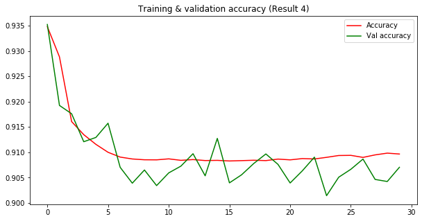
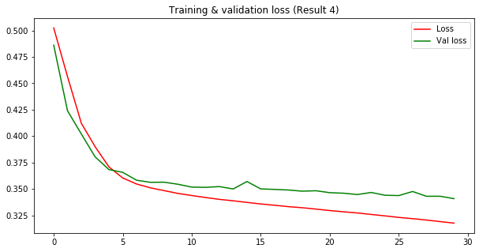

# Experiment 1-Replication

* This is from Russell et. al work (Automated Vulnerability Detection in Source Code Using Deep Representation Learning) https://arxiv.org/abs/1807.04320
* Datasets downloaded from https://osf.io/d45bw/
* Datasets distribution: Training (80%), Validation (10%), Testing (10%)
* The dataset consists of the source code of 1.27 million functions mined from open source software, labeled by static analysis for potential vulnerabilities.
* Each function's raw source code, starting from the function name, is stored as a variable-length UTF-8 string. Five binary 'vulnerability' labels are provided for each function, corresponding to the four most common CWEs in our data plus all others: 
 * CWE-120 (3.7% of functions)
 * CWE-119 (1.9% of functions)
 * CWE-469 (0.95% of functions)
 * CWE-476 (0.21% of functions)
 * CWE-other (2.7% of functions)
* Functions may have more than one detected CWE each.
* Python 3.6.9 and Tensorflow 2.0.0

### Important note

The dataset might have been updated by the owner.  
The `functionSource` column now, contains a bytes string object.  
We need to decode it to a literal string.  
You can do that by mapping:  
`mydf['functionSource'] = mydf['functionSource'].str.decode("utf-8")`

### Datasets  

Will be added if required.  
Aside for having the 5 columns for y's (CWE-120...n ), we added a new column that has the results of a logical OR operation each row.  
Therefore, the 7th column in the dataset is called "**combine**". This column allows for a binary detection of software vulnerabilities.  
Since it is a multiple output binary classification problem, we simplified the problem to become a **binary** problem to immitate the results portrayed in the paper.  
The 7th column addresses the question of whether the observation/row is **vulnerable** or **non-vulnerable**.  

### Jupyter Lab Notebooks  

1. `SVD_1.ipynb` - The experiments for multiple output multiple class vulnerability detection.  
2. `SVD_2.ipynb` - The experiments for single class (**CWE-119**) binary detection.  
3. `SVD_3.ipynb` - The experiments for binary detection of the newly added 7th column (**combine**).

### Results 
#### SVD_1 (Multiple output binary classification)
* The results are not good as there are no suitable metrics to monitor during training of a multi output binary classification (MOBC) problem. 
#### SVD_2 (Single output binary classification)
* Since MOBC is not really effective in understanding a new predictive model and tuning the hyper-parameters, we decided to focus on only one vulnerability (CWE-119).
* By focusing on this vulnerability, we experimented with different settings of:
	* Embeddings weights
	* Class weights
	* Max-pooling sizes
	* Dropout rates (regularization)
* The table below shows the evaluation of the testing set (*some ridiculous  results are not included*)

The results below (20 epochs, 0.005 learning rate, unless stated otherwise):

| No.|MaxPool|Weights (0 : 1)|TP|FP|TN|FN|Acc|Precision|Recall|PR-AUC|AUC|MCC|F1|
|---	|---	|---	|---	|---	|---	|---	|---	|---	|---	|---	|---	|---	|---	|
|  BL	|  BL|  BL	| BL|  BL 	|  BL  	| BL  	|BL| BL  	|  BL 	|  **0.467**| **0.897**|**0.509**| **0.540**|
|  1	|  4	| 1 : 50  	|  2090   	|  9883  	| 115084  	|362| 0.9195  	|  0.1745  	| 0.8523 	| 0.3272| 0.9433|0.3640| 0.2897|
|  2	|  4	| 1 : 35  	|  2089	    |  8480  	| 116487  	|363| 0.9305   	|  0.1976  	| 0.8519 	| 0.3516| 0.9450|0.3905| 0.3208|
|  3	|  4	| 1 : 25   	|  2055 	|  7442  	| 117525  	|397| 0.9384  	|  0.2163 	| 0.8380  	| 0.3472| 0.9455|0.4072| 0.3439|
|  4	|  4	| 1 : 20   	|  2040 	|  6989  	| 117978  	|412| 0.9419  	|  0.2259 	| 0.8319  	| 0.3441| 0.9459|0.4154| 0.3553|
|  5	|  4	| 1 : 15   	|  1994 	|  5937  	| 119030  	|458| 0.9498  	|  0.2514 	| 0.8132  	| 0.3533| 0.9455|0.4354| 0.3840|
|  6	|  4	| 1 : 10   	|  1930 	|  5257  	| 119710  	|522| 0.9546  	|  0.2685 	| 0.7871  	| 0.3479| 0.9463|0.4436| 0.4004|
|  7	|  4	| 1 : 5   	|  1610 	|  3240  	| 121727  	|842| 0.9679  	|  0.3319 	| 0.6566  	| 0.3343| 0.9430|0.4527| 0.4409|
|  8	|  3	| 1 : 5 (40ep)|  1801 	|  3780  	| 121187  	|651| 0.9652  	|  0.3227 	| 0.7345  	| 0.3661| 0.9429|0.4727| 0.4484|
|  9	|  4	| 1 : 5 (40ep)|  1740 	|  3417  	| 121550  	|712| 0.9675  	|  0.3374 	| 0.7096  	| 0.3717| 0.9436|0.4756| 0.4573|
|  10	|  5	| 1 : 5 (40ep)|  1784 	|  3591  	| 121376  	|668| 0.9665  	|  0.3319 	| 0.7275  	| 0.3710| 0.9437|0.4776| 0.4558|

#### SVD_3

Once we have experimented and tune the model, we have found a decent settings for the hyper-parameters to achieve a fairly good model (*performance is near to the one reported in the paper*).  
The table below shows the evaluation of the testing against the **combine** (7th) column.  

The results are as below (30 epochs unless stated):

| No.| Learning_Rate|MaxPool|Weights (0 : 1)|TP|FP|TN|FN|Acc|Precision|Recall|PR-AUC|AUC|MCC|F1|
|---	|---	|---	|---	|---	|---	|---	|---	|---	|---	|---	|---	|---	|---	|---	|
|  BL	|  BL|  BL	| BL|  BL 	|  BL  	| BL  	|BL| BL  	|  BL 	| BL 	| **0.467**| **0.897**|**0.509**| **0.540**|
|  1	|  0.005|  4	| 1 : 5|  5817 	|  11376  	| 107790  	|2436| 0.8916  	|  0.3383 	| 0.7048  	| 0.3858| 0.8871|0.4389| 0.4572|
|  2	| 0.0005|  4	| 1 : 5|  4668 	|  9702  	| 109464  	|3585| 0.8957  	|  0.3248 	| 0.5656  	| 0.3172| 0.8595|0.3767| 0.4126|
|  3	| 0.005 |  5	| 1 : 5|  5924 	|  12066  	| 107100  	|2329| 0.8870  	|  0.3292 	| 0.7177  	| 0.3761| 0.8866|0.4357| 0.4514|
|  4	| 0.005 |  4	| 1 : 3|  5093 	|  8666  	| 110500  	|3160| 0.9071  	|  0.3701 	| 0.6171  	| 0.3665| 0.8830|0.4317| 0.4627|

  

  

### Discussion/Highlights/Issues
* This replication experiment aims to understand how software vulnerability detection is implemented in a deep learning settings using source codes as the input features. 

* An eye opening example that uses source codes (functional level) to detect software vulnerabilities. This experiment is quite challenging and interesting at the same time as there are some unclear or unmentioned information regarding the architecture of the model.

* It is important to note that we only implemented the Convolutional Neural Network (CNN) approach rather than all of the other approaches mentioned in the paper (i.e. RNN, CNN+RF, RNN+RF). This is because the goal of this experiment is to understand more about the implementation of source codes as the input vector for the neural networks. So, it is not really important for us to achieve the exact same results as the results mentioned in the paper.

* The authors didn't mention about how they performed their prediction in terms of number of classes. The provided datasets have 5 diffferent output classes with each of the class being a logical value `TRUE` or `FALSE`. Therefore, it is unknown how the authors actually managed to achieve the **binary detection** results tabulated in the paper. To overcome this, we implemented logical `OR` operation across all the output columns for all the observations in the dataset. The output of this operation is stored a new column called `combine`. 

* The authors mentioned of using random gaussian noise to each embedded representations. It is **unclear** whether the random gaussian noise is added as a _*layer on top of the input embeddings*_ or as the *weights of each embeddings*. 

* Since we know that pseudo-random number depends on the seed value of a random number generator. This greatly relates with random gaussian noise generated for the embeddings. Therefore, replicating the experiments to achieve the same results is quite impossible as the **seed number** is not mentioned in the paper.

* The size of `maxpool` is not mentioned in the paper. Therefore, in `SVD_2.ipynb` , we experimented with different sizes of maxpool. To achieve a suitable value that can maximizes the learning process when the max-pooling process occurs across the convolutions. We found that the size of `3-4` is fairly effective to capture the information across the source code embeddings

* Due to the unbalanced datasets, we implements **class weights** and experimented with different values of class weights in `SVD_2.ipynb`. We found that the ratio of `1:5` and `1:3` **(Non-vul:Vul)** is good to balance the information acquired from both of the classes (**Vulnerable/Non-vulnerable**).
